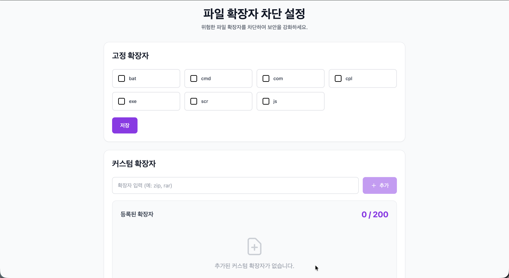

<p align="center">
  
</p>

<h1 align="center">🛡️ File Extension Blocker</h1>
<h3 align="center">위험한 파일 확장자를 차단하여 보안을 강화하는 웹 애플리케이션</h3>

<p align="center">
  
  
  
</p>

<p align="center">
  <a href="https://blocker-dani.vercel.app">🌐 Live Demo</a> •
  <a href="https://file-extension-blocker-pf9s.onrender.com/api-docs">📚 API Docs</a> •
  <a href="https://github.com/danikim8/file-extension-blocker">💻 GitHub</a>
</p>

---

## 📋 과제 요구사항 체크리스트

### ✅ 필수 기능 구현 (100%)

<table>
<tr>
<td width="50%">

**고정 확장자 관리**
- 7개 고정 확장자 제공
- 체크박스 개별 차단 설정
- 일괄 저장 기능
- 사용자별 설정 저장

**커스텀 확장자 관리**
- 최대 200개 추가
- 영문 소문자/숫자/언더스코어 허용
- 최대 20자 제한
- 중복 체크 (대소문자 무관)
- 개별 삭제 기능

</td>
<td width="50%">

**파일 업로드 차단 테스트**
- 파일 업로드 기능
- 확장자 자동 추출
- 차단 목록 비교
- 차단/허용 결과 표시

**사용자 관리**
- LocalStorage 기반 ID 생성
- 사용자별 독립 설정

</td>
</tr>
</table>

### ✅ 기술 스택 요구사항 (100%)

| 구분 | 요구사항 | 적용 기술 |
|------|----------|----------|
| **Backend** | Node.js + Express | Node.js 22 + Express 5.2.1 |
| | TypeScript | TypeScript 5.9.3 |
| | PostgreSQL | Supabase |
| | ORM | Prisma 7.2.0 |
| | API 문서화 | Swagger/OpenAPI 3.0 |
| **Frontend** | React | React 19.2.0 |
| | TypeScript | TypeScript 5.9 |
| | UI 라이브러리 | Tailwind CSS 3.4.19 |
| | 폼 관리 | React useState (Controlled) |

### ✅ 테스트 요구사항 (100%)

**38개 테스트 전체 통과 (커버리지 88%)**
- Unit Test 13개: validator, errorHandler
- Integration Test 25개: API 엔드포인트, 에러 핸들링
- Jest + Supertest 사용

### ✅ 배포 요구사항 (100%)

- **Frontend**: [Vercel](https://blocker-dani.vercel.app)
- **Backend**: [Render](https://file-extension-blocker-pf9s.onrender.com)
- **Database**: Supabase (PostgreSQL)
- **API 문서**: [Swagger UI](https://file-extension-blocker-pf9s.onrender.com/api-docs)

### 🎁 추가 구현 (보너스)

**CI/CD & 자동화**
- GitHub Actions (테스트 자동화 + 자동 배포)
- Prisma 7 Adapter 패턴 (최신 기술)
- Prisma Singleton 패턴 (연결 풀 관리)

**UX 개선**
- 드래그 앤 드롭 UI
- 토스트 알림 (Sonner)
- 대소문자 무관 중복 체크
- 입력값 정규화 (공백/점 제거)

**문서화**
- 트러블슈팅 문서 (4개)
- Swagger API 문서
- 상세 README

---

## 목차

1. [기술 스택](#1-기술-스택)
2. [시작하기](#2-시작하기)
3. [API 엔드포인트](#3-api-엔드포인트)
4. [테스트](#4-테스트)
5. [CI/CD](#5-cicd)
6. [트러블슈팅](#6-트러블슈팅)
7. [폴더 구조](#7-폴더-구조)

---

## 1. 기술 스택

### Frontend


### Backend


### DevOps


---

## 2. 시작하기

### 사전 요구사항
- Node.js 22 이상
- PostgreSQL 데이터베이스 (Supabase 권장)

### 설치 및 실행

```bash
# 저장소 클론
git clone https://github.com/danikim8/file-extension-blocker.git
cd file-extension-blocker

# Backend 설정
cd backend
npm install
# .env 파일 생성 후 DATABASE_URL, DIRECT_URL, PORT 설정
npx prisma migrate dev
npm run dev

# Frontend 설정 (새 터미널)
cd frontend
npm install
# .env 파일 생성 후 VITE_API_URL 설정
npm run dev

# 브라우저에서 http://localhost:5173 접속
```

---

## 3. API 엔드포인트

### Base URL
- **프로덕션**: `https://file-extension-blocker-pf9s.onrender.com`

### 주요 엔드포인트

| Method | Endpoint | Description |
|--------|----------|-------------|
| `GET` | `/health` | 서버 상태 확인 |
| `GET` | `/api/extensions/fixed` | 고정 확장자 조회 |
| `PUT` | `/api/extensions/fixed` | 고정 확장자 저장 |
| `GET` | `/api/extensions/custom` | 커스텀 확장자 조회 |
| `POST` | `/api/extensions/custom` | 커스텀 확장자 추가 |
| `DELETE` | `/api/extensions/custom/:id` | 커스텀 확장자 삭제 |
| `GET` | `/api-docs` | Swagger API 문서 |

자세한 API 스펙은 [Swagger UI](https://file-extension-blocker-pf9s.onrender.com/api-docs)에서 확인 가능합니다.

---

## 4. 테스트

### ✅ 38개 테스트 전체 통과 (100%)

#### Unit Tests (13개)
- `normalizeExtension`: 공백/점 제거, 소문자 변환
- `validateExtension`: 형식/길이/경계값 검증
- `errorHandler`: 에러 핸들링 미들웨어

#### Integration Tests (25개)
- 고정 확장자 조회/저장
- 커스텀 확장자 CRUD
- 대소문자 무관 중복 체크
- 200개 제한 검증
- 에러 핸들링

### 테스트 실행

```bash
cd backend

npm test              # 전체 테스트
npm run test:coverage # 커버리지 (88%+)
npm run type-check    # 타입 체크
```

---

## 5. CI/CD

### GitHub Actions

**main 브랜치 푸시 시 자동 실행:**

- ✅ Backend: Jest 테스트 38개 + TypeScript 타입 체크
- ✅ Frontend: 프로덕션 빌드 + TypeScript 타입 체크

### 배포 프로세스

```
코드 작성 → main 푸시 → GitHub Actions 테스트
    ↓
테스트 통과 → Vercel/Render 자동 배포 → 배포 완료 ✅
```

**배포 환경:**
- Frontend: Vercel (main 브랜치 자동 배포)
- Backend: Render (main 브랜치 자동 배포)
- Database: Supabase (PostgreSQL)

---

## 6. 트러블슈팅

<details>
<summary><strong>Prisma 7 Adapter 마이그레이션</strong></summary>

### Problem
Prisma 7에서 `@prisma/adapter-pg` 필수 사용으로 변경, Supabase Session mode 연결 실패

### Solution
```typescript
import { PrismaClient } from '@prisma/client';
import { PrismaPg } from '@prisma/adapter-pg';
import { Pool } from 'pg';

const pool = new Pool({ connectionString: process.env.DATABASE_URL });
const adapter = new PrismaPg(pool);
const prisma = new PrismaClient({ adapter });
```

### Result
✅ Supabase Session mode 연결 성공  
✅ 안정적인 연결 풀 관리

</details>

<details>
<summary><strong>Render 배포 시 TypeScript 컴파일 오류</strong></summary>

### Problem
테스트 파일(`*.test.ts`)이 컴파일 대상에 포함되어 빌드 실패

### Solution
```json
// tsconfig.json
{
  "exclude": [
    "node_modules",
    "**/*.test.ts",
    "**/__tests__/**"
  ]
}
```

### Result
✅ Render 빌드 성공  
✅ 빌드 시간 단축

</details>

<details>
<summary><strong>대소문자 무관 중복 체크 구현</strong></summary>

### Problem
`pdf`와 `PDF`를 다른 값으로 인식

### Solution
```typescript
export function normalizeExtension(ext: string): string {
  return ext.trim().replace(/^\.+/, '').toLowerCase();
}

// API에서 정규화 적용
const normalizedName = normalizeExtension(name);
const existing = await prisma.customExtension.findFirst({
  where: { userId, name: normalizedName }
});
```

### Result
✅ `pdf`, `PDF`, `.PDF` 모두 동일하게 처리  
✅ 데이터베이스에 항상 소문자로 저장

</details>

<details>
<summary><strong>Prisma Singleton 패턴 적용</strong></summary>

### Problem
여러 파일에서 `new PrismaClient()`를 각각 생성하여 연결 풀 낭비 및 테스트 시 모킹 어려움

### Solution
```typescript
// backend/src/config/prisma.ts
import { PrismaClient } from '@prisma/client';
import { PrismaPg } from '@prisma/adapter-pg';
import { Pool } from 'pg';

const pool = new Pool({ connectionString: process.env.DATABASE_URL });
const adapter = new PrismaPg(pool);
const prisma = new PrismaClient({ adapter });

export default prisma;
```

### Result
✅ 단일 Prisma Client 인스턴스로 연결 풀 효율적 관리  
✅ 테스트에서 쉽게 모킹 가능  
✅ 코드 중복 제거

</details>

---

## 7. 폴더 구조

```bash
file-extension-blocker/
├── 📁 frontend/
│   ├── 📁 src/
│   │   ├── 📁 components/      # React 컴포넌트
│   │   ├── 📁 hooks/           # Custom Hooks
│   │   ├── 📁 services/        # API 서비스
│   │   ├── 📁 types/           # TypeScript 타입
│   │   ├── 📁 utils/           # 유틸리티
│   │   └── App.tsx
│   └── 📁 public/              # 정적 파일
│
├── 📁 backend/
│   ├── 📁 src/
│   │   ├── 📁 routes/          # API 라우트
│   │   ├── 📁 config/          # Prisma, Swagger
│   │   ├── 📁 middleware/      # 에러 핸들러
│   │   ├── 📁 utils/           # Validator
│   │   └── server.ts
│   └── 📁 prisma/              # Schema & Migrations
│
└── 📁 .github/workflows/       # CI/CD
```

---

## 👤 개발자

**김단이**
- Portfolio: [portfolio-danikim.vercel.app](https://portfolio-danikim.vercel.app)
- GitHub: [@danikim8](https://github.com/danikim8)

---

<p align="center">
  Made with 💜 by Dani Kim
</p>
